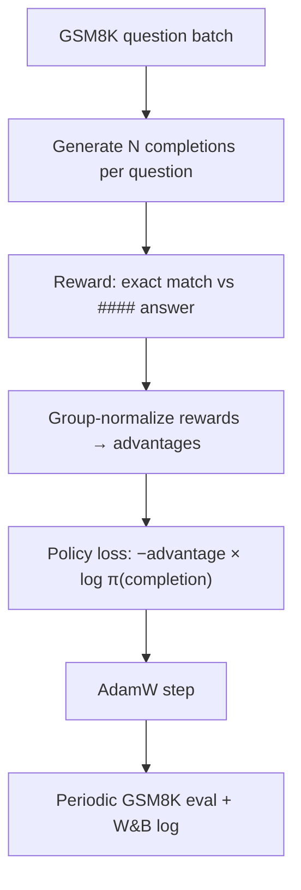

# RLVR Learning Lab

A phased playground for **Reinforcement Learning from Verifiable Rewards (RLVR)** on instruction-tuned LLMs, starting with GSM8K.

**Current model:** [`Qwen/Qwen2.5-0.5B-Instruct`](https://huggingface.co/Qwen/Qwen2.5-0.5B-Instruct) (vendored under `models/Qwen2.5-0.5B-Instruct/`). The codebase also supports larger Qwen checkpoints, but active experiments use the 0.5B model for fast iteration.

**Current algorithm:** **REINFORCE** with group-normalized advantages. **GRPO** (PPO-style clipping + KL to a frozen reference policy) is stubbed in code but **not wired up yet** — that will be added in a follow-up.

## Prerequisites

| Item | Notes |
|------|-------|
| Python env | `conda activate olmo` (or any env with `torch`, `transformers>=4.51`, `datasets`) |
| Model weights | `models/Qwen2.5-0.5B-Instruct/` (see download below) |
| W&B (optional) | Set `WANDB_API_KEY` in `rlvr/.env` or your shell |

### Install

```bash
cd /home/coder/Projects/rlvr
conda activate olmo
pip install -e .
```

Optional eval extras: `pip install -e ".[eval]"` (for future lm-eval integration).

### One-time model download

```bash
bash scripts/download_model.sh 0.5b-instruct
```

### Environment variables

Configs read `MODEL_PATH` and `OUT_ROOT` via OmegaConf env interpolation. Set them once per shell session (or put them in `rlvr/.env`):

```bash
export RLVR_ROOT=/home/coder/Projects/rlvr
export MODEL_PATH=$RLVR_ROOT/models/Qwen2.5-0.5B-Instruct
export OUT_ROOT=$RLVR_ROOT/outputs
export WANDB_ENTITY=<your-wandb-entity>   # optional
```

Training also auto-loads `rlvr/.env` via `qwen3_rlvr.env.load_project_env()`.

## Project layout

```
rlvr/
├── configs/                 # YAML configs for eval + training
├── models/                  # vendored HF weights (gitignored)
├── outputs/                 # run artifacts (gitignored)
├── scripts/                 # CLI entrypoints
├── src/qwen3_rlvr/          # Python package
├── docs/                    # local notes only (gitignored)
└── experiments/             # local run registry only (gitignored)
```

`docs/` and `experiments/` are kept on disk for local reference but are **not tracked in git** (see `.gitignore`).

## Phase 0 — Pass@K evaluation

Baseline **before** RL: sample `N` completions per GSM8K question and report Pass@K.

### Using the config (recommended)

```bash
cd $RLVR_ROOT
conda activate olmo

python scripts/pass_at_k.py \
  --config configs/phase0_passk.yaml \
  --output-dir $OUT_ROOT/phase0_passk_gsm8k
```

Defaults in `configs/phase0_passk.yaml`:
- split: `test`
- `k`: `[1, 3, 5]`, `n_generations`: `5`
- `question_batch_size`: `8` (tune up until GPU is ~80–90% utilized)

### CLI overrides

```bash
python scripts/pass_at_k.py \
  --config configs/phase0_passk.yaml \
  --model $MODEL_PATH \
  --split test \
  --k 1,3,5 \
  --n-generations 5 \
  --max-samples 200 \
  --question-batch-size 8 \
  --output-dir $OUT_ROOT/my_passk_run \
  --wandb-expt-name qwen25_p0_passk_smoke \
  --monitor-resources
```

Use `--no-wandb` to skip W&B. Results are written to `<output-dir>/pass_at_k_summary.json`.

### Example output

```
pass@1: 0.42xx
pass@3: 0.58xx
pass@5: 0.62xx
Saved summary: outputs/.../pass_at_k_summary.json
```

## Phase 1 — REINFORCE training

Group-sampled rollouts on GSM8K train, exact-match reward, advantage normalization, policy-gradient update.

> **Note:** `scripts/train_grpo.py` and `GRPOTrainer` are named for the target algorithm, but **`grpo.reinforce: true` must be set** (as in the bundled config). Full GRPO (clipped ratio + KL penalty) is not enabled yet.

### Using the config (recommended)

```bash
cd $RLVR_ROOT
conda activate olmo

python scripts/train_grpo.py \
  --config configs/phase1_rlvr_gsm8k_reinforce.yaml \
  --output-dir $OUT_ROOT/qwen25_p1_reinforce_gsm8k
```

Defaults in `configs/phase1_rlvr_gsm8k_reinforce.yaml`:
- `max_steps`: `100`
- `batch_size`: `4`, `grad_accum_steps`: `2` (effective 8 questions per optimizer step)
- `n_generations`: `10` completions per question
- `lr`: `1e-6`
- in-loop GSM8K eval every `25` steps on 200 test examples

### CLI overrides

```bash
python scripts/train_grpo.py \
  --config configs/phase1_rlvr_gsm8k_reinforce.yaml \
  --max-steps 50 \
  --batch-size 2 \
  --grad-accum-steps 1 \
  --lr 1e-6 \
  --wandb-name qwen25_p1_reinforce_debug \
  --output-dir $OUT_ROOT/qwen25_p1_debug
```

OmegaConf dot-path overrides:

```bash
python scripts/train_grpo.py \
  --config configs/phase1_rlvr_gsm8k_reinforce.yaml \
  --override dataset.max_samples=500 \
  --override grpo.n_generations=4
```

Use `--no-wandb` for a local-only run.

### Training outputs

Under `<output-dir>/`:

| Artifact | Description |
|----------|-------------|
| `train_metrics.jsonl` | Per-step loss, reward, advantage stats |
| `samples.jsonl` | Logged completions with rewards |
| `eval_step_<N>.json` | Periodic GSM8K Pass@K during training |
| `checkpoints/step_<N>/` | HF-format policy checkpoints |
| `resource_monitor.json` | CPU/GPU sampling (always written by trainer) |

### Phase 2 — progress report (optional)

Build an HTML gallery from `samples.jsonl`:

```bash
python scripts/make_progress_report.py \
  --samples $OUT_ROOT/qwen25_p1_reinforce_gsm8k/samples.jsonl \
  --output $OUT_ROOT/qwen25_p1_reinforce_gsm8k/progress.html
```

## Training loop (REINFORCE)



## W&B metrics

| Group | Metrics |
|-------|---------|
| `train` | `loss`, `reward_mean`, `reward_std`, `frac_correct`, `advantage_mean`, `advantage_std`, `group_reward_spread` |
| `loss/*` | `num_loss_terms`, `policy_logp_mean` |
| `eval/gsm8k` | `pass@1`, `pass@k` (periodic) |
| `samples` | Tables of question, completion, reward, stage |

## Roadmap

| Phase | Status |
|-------|--------|
| 0 — Pass@K baseline | **Done** (`scripts/pass_at_k.py`) |
| 1 — REINFORCE on GSM8K | **Done** (`scripts/train_grpo.py` + `configs/phase1_rlvr_gsm8k_reinforce.yaml`) |
| 1b — GRPO (clip + KL) | **Planned** — code scaffold exists, not enabled |
| 2 — Monitoring / viz | Partial (`make_progress_report.py`) |
| 3+ — lm-eval harness, multi-domain | Planned |

## Status

| Component | Status |
|-----------|--------|
| Pass@K eval | Done |
| REINFORCE trainer | Done |
| GRPO trainer | Not enabled yet |
| Batched log-prob forward | Done |
| Local `docs/`, `experiments/` | Gitignored; kept locally only |
