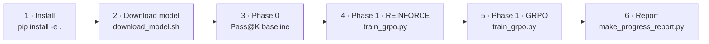
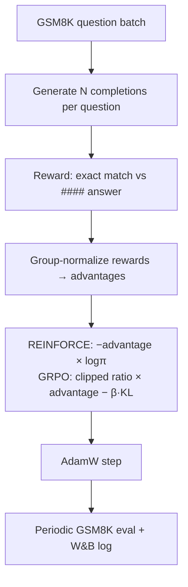

# RLVR Training Lab

A compact, **hackable training pipeline for Reinforcement Learning from Verifiable
Rewards (RLVR)** on instruction-tuned LLMs, using GSM8K math word problems as the
verifiable task. It implements two policy-gradient algorithms — **REINFORCE** and
**GRPO** — on top of Hugging Face `transformers`, with Pass@K evaluation and W&B logging.

Default model: [`Qwen/Qwen2.5-0.5B-Instruct`](https://huggingface.co/Qwen/Qwen2.5-0.5B-Instruct)
for fast iteration; larger Qwen checkpoints work via the same scripts.

> **Scope.** This is a learning-oriented reference implementation: it favors readable,
> from-scratch code over strict fidelity to the papers. The REINFORCE and GRPO updates
> are intentionally simple — read the code in `src/qwen3_rlvr/rl/` before relying on it
> for research baselines.

## The pipeline



Each step below is a single command. Phase 0 measures the model *before* RL so you have
a baseline; Phase 1 runs the two RL algorithms; the report visualizes how completions improve.

## 1 · Install

```bash
git clone https://github.com/sanketsans/rlvr.git && cd rlvr
pip install -e .            # core; add ".[eval]" for lm-eval, ".[dev]" for pytest/ruff
```

Works in any Python ≥ 3.10 environment (venv, conda, etc.) with a CUDA GPU for training.

## 2 · Download the model

```bash
bash scripts/download_model.sh 0.5b-instruct   # -> models/Qwen2.5-0.5B-Instruct
```

Variants: `0.5b-instruct` (default), `instruct` (Qwen3-4B-Instruct), `base` (Qwen3-4B-Base).

### Configuration

Configs default to `./models/Qwen2.5-0.5B-Instruct` and `./outputs`, so no setup is
needed if you downloaded as above. To point elsewhere, set environment variables (read
by the configs via OmegaConf, and auto-loaded from a gitignored `.env` — see `template.env`):

```bash
export MODEL_PATH=/abs/path/to/model     # overrides the model
export OUT_ROOT=/abs/path/to/outputs     # overrides where runs are written
export WANDB_API_KEY=...                 # optional: enable W&B logging
export WANDB_ENTITY=<your-entity>        # optional
```

Add `--no-wandb` to any training/eval command to run fully local.

## 3 · Phase 0 — Pass@K baseline

Sample `N` completions per GSM8K test question and report Pass@K, *before* any training:

```bash
python scripts/pass_at_k.py --config configs/phase0_passk.yaml
```

Writes `pass_at_k_summary.json` to the output dir. Tune `passk.question_batch_size` in the
config up until the GPU is ~80–90% utilized. Common overrides: `--max-samples 200`,
`--k 1,3,5`, `--output-dir <dir>`.

## 4 · Phase 1 — REINFORCE

Group-sampled rollouts on GSM8K train, exact-match reward (parse `#### <answer>`),
group-normalized advantages, policy-gradient update.

```bash
python scripts/train_grpo.py --config configs/phase1_rlvr_gsm8k_reinforce.yaml
```

## 5 · Phase 1 — GRPO

Same rollouts, but a PPO-style **clipped ratio** plus a **KL penalty to a frozen reference
policy**. Selected by `grpo.reinforce: false` in the config:

```bash
python scripts/train_grpo.py --config configs/phase1_rlvr_gsm8k_grpo.yaml
```

> One script (`train_grpo.py`) runs both algorithms; the `grpo.reinforce` flag in the
> config picks `ReinforceTrainer` vs `GRPOTrainer`.

**Common overrides** (CLI flags, or `--override key=value` for any config field):

```bash
python scripts/train_grpo.py --config configs/phase1_rlvr_gsm8k_grpo.yaml \
  --max-steps 50 --batch-size 2 --lr 1e-6 \
  --override grpo.n_generations=4 --override dataset.max_samples=500
```

### Training loop



## 6 · Progress report (optional)

Build an HTML gallery of logged completions and rewards over training:

```bash
python scripts/make_progress_report.py \
  --samples outputs/<run>/samples.jsonl \
  --output  outputs/<run>/progress.html
```

## Project layout

```
rlvr/
├── configs/             # YAML configs for eval + training (one per phase)
├── scripts/             # CLI entrypoints (download, pass_at_k, train_grpo, …)
├── src/qwen3_rlvr/      # package
│   ├── data/            # dataset + recipe loaders (gsm8k, math, aime)
│   ├── generation/      # prompt formatting + rollout sampling
│   ├── rewards/         # answer extraction + exact-match reward
│   ├── rl/              # grpo.py (advantages + loss), trainer.py (loops)
│   ├── eval/            # Pass@K + benchmark harness
│   └── logging/         # W&B, resource monitor, sample logging
├── tests/               # unit tests (pytest)
├── models/              # downloaded HF weights (gitignored)
└── outputs/             # run artifacts (gitignored)
```

## Training outputs

Under `<output-dir>/`:

| Artifact | Description |
|----------|-------------|
| `train_metrics.jsonl` | Per-step loss, reward, advantage stats |
| `samples.jsonl` | Logged completions with rewards |
| `eval_step_<N>.json` | Periodic GSM8K Pass@K during training |
| `checkpoints/step_<N>/` | HF-format policy checkpoints (best-so-far) |
| `resource_monitor.json` | CPU/GPU sampling |

## W&B metrics

| Group | Metrics |
|-------|---------|
| `train` | `loss`, `reward_mean`, `reward_std`, `frac_correct`, `advantage_mean/std`, `group_reward_spread` |
| `loss/*` | REINFORCE: `policy_logp_mean`; GRPO: `pg_loss`, `kl_loss`, `clip_fraction`, `ratio_mean` |
| `eval/*` | `pass@1`, `pass@k` (periodic, per recipe) |
| `samples` | Tables of question, completion, reward, stage |

## Other scripts

| Script | Purpose |
|--------|---------|
| `scripts/benchmark.py` | Greedy + best-of-N benchmark across eval recipes (`configs/phase0_benchmark.yaml`) |
| `scripts/launch_phase1_sweep.py` | Launch a hyperparameter sweep over Phase 1 runs |
| `scripts/rejection_sampling_data_curation.py` | Curate SFT data by rejection sampling |

## Tests

```bash
pip install -e ".[dev]"
pytest
```

## Roadmap

| Phase | Status |
|-------|--------|
| 0 — Pass@K baseline | ✅ Done |
| 1 — REINFORCE on GSM8K | ✅ Done |
| 1 — GRPO (clip + KL) | ✅ Done |
| 2 — Monitoring / viz | 🟡 Partial (`make_progress_report.py`) |
| 3+ — lm-eval harness, multi-domain | ⬜ Planned |

## License

[MIT](LICENSE) © Sanket Thakur
