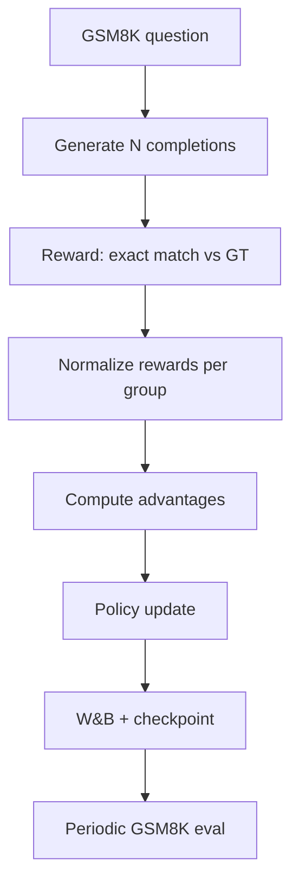

# Qwen3 RLVR Learning Lab

A phased, reproducible playground for **Reinforcement Learning from Verifiable Rewards (RLVR)** on **Qwen3-4B-Instruct**, starting with GSM8K and scaling to multi-domain training and verifier-guided selection.

This project is standalone under `Projects/qwen3_rlvr`. It uses **HuggingFace Transformers** for the base model (no Molmo2 / vision stack). All RLVR logic, configs, eval hooks, and SkyPilot launchers live here.

## Goals

1. Learn how RL post-training works end-to-end (not just call a black-box trainer).
2. Measure **Pass@K** before RL, then verify RL is actually moving the needle.
3. Log everything to **Weights & Biases** with interpretable stage-wise artifacts.
4. Run locally (`conda` env `olmo`) then promote the same commands to **SkyPilot** on H200.

## Prerequisites

| Item | Location / command |
|------|-------------------|
| Base model (HF) | `models/Qwen3-4B-Instruct/` (see download below) |
| HF model ID | `Qwen/Qwen3-4B-Instruct-2507` |
| Local conda env | `olmo` |
| W&B | `WANDB_API_KEY` |
| HF cache | `HF_HOME` (optional; model is vendored under `models/`) |

### One-time model download

```bash
bash scripts/download_model.sh
# or manually:
# huggingface-cli download Qwen/Qwen3-4B-Instruct-2507 \
#   --local-dir models/Qwen3-4B-Instruct
```

### Environment variables (reuse everywhere)

```bash
export RLVR_ROOT=/home/coder/Projects/qwen3_rlvr
export MODEL_PATH=$RLVR_ROOT/models/Qwen3-4B-Instruct
export OUT_ROOT=$RLVR_ROOT/outputs
export HF_HOME=$RLVR_ROOT/.cache/huggingface
export WANDB_PROJECT=qwen3-rlvr
export WANDB_ENTITY=<your-entity>
```

## Architecture (high level)

```
qwen3_rlvr/
├── models/Qwen3-4B-Instruct/   # vendored HF weights
├── configs/                    # YAML per phase / experiment
├── src/qwen3_rlvr/             # Python package (data, rewards, GRPO, eval, logging)
├── scripts/                    # pass@k, train, eval, download_model
├── skypilot/                   # SkyPilot YAMLs
├── experiments/                # Run registry
└── docs/                       # Phase guides, design notes
```

**Data flow (GRPO, Phase 1):**



## Phased roadmap

| Phase | Objective | Key metric | Doc |
|-------|-----------|------------|-----|
| **0** | Baseline Pass@K on Qwen3-4B-Instruct | Pass@1, Pass@8, Pass@16 | [docs/PHASES.md](docs/PHASES.md#phase-0--passk-baseline) |
| **1** | Minimal GSM8K-only GRPO | train reward, loss | [docs/PHASES.md](docs/PHASES.md#phase-1--minimal-gsm8k-grpo) |
| **2** | Prove RL is working + interpretability | GSM8K acc vs step, sample galleries | [docs/PHASES.md](docs/PHASES.md#phase-2--verify-and-visualize) |
| **3** | Generalization via lm-eval-harness | GSM8K, MATH nearby, MMLU far | [docs/PHASES.md](docs/PHASES.md#phase-3--generalization-benchmarks) |
| **4** | Multi-domain mixture (GSM8K 65%, Math 25%, …) | per-domain + aggregate | [docs/PHASES.md](docs/PHASES.md#phase-4--multi-domain-mixture) |
| **5** | Verifier model + best-of-N selection | verifier accuracy, BoN gain | [docs/PHASES.md](docs/PHASES.md#phase-5--verifier--best-of-n) |

See [docs/ARCHITECTURE.md](docs/ARCHITECTURE.md) for module design, GRPO math, and eval integration.

## Implementation choices (decision record)

### A. GRPO stack — **recommended: custom GRPO via Transformers**

| Option | Pros | Cons |
|--------|------|------|
| **A. Transformers + custom GRPO** (default) | Full visibility; native HF checkpoints; works with `lm_eval` out of the box | More code to write |
| B. TRL `GRPOTrainer` | Fast bootstrap | Less transparent internals |
| C. verl / OpenRLHF | Production scale | Heavy; poor fit for a toy lab |

### B. Eval stack — **recommended: in-project GSM8K + lm-eval-harness**

| Layer | Tool | When |
|-------|------|------|
| Training-time GSM8K | `src/qwen3_rlvr/eval/gsm8k.py` | Every N optimizer steps (Phase 1–2) |
| Pass@K | `scripts/pass_at_k.py` | Phase 0 |
| Text benchmarks (GSM8K, MMLU, …) | `lm-eval` (`lm_eval` CLI) | Phase 3–4 |

### C. SkyPilot runtime — **conda bootstrap + FSx volume**

Matches local `olmo` env; no Molmo2 Docker required.

## Quick start (local smoke test)

```bash
conda activate olmo
cd $RLVR_ROOT && pip install -e ".[eval]"

# Phase 0 — after implementation
python scripts/pass_at_k.py \
  --model $MODEL_PATH \
  --dataset gsm8k \
  --split test \
  --k 1,8,16 \
  --n-samples 500 \
  --wandb-run qwen3_rlvr_p0_passk_gsm8k_baseline
```

## SkyPilot

```bash
sky jobs launch skypilot/phase1_grpo_debug.yaml \
  --env WANDB_API_KEY=$WANDB_API_KEY \
  --env EXP_NAME=qwen3_rlvr_p1_grpo_gsm8k_debug
```

## Experiment naming

```
qwen3_rlvr_<phase>_<dataset>_<knob>_<tag>
```

Examples:
- `qwen3_rlvr_p0_passk_gsm8k_k16_baseline`
- `qwen3_rlvr_p1_grpo_gsm8k_n8_lr1e6_run01`
- `qwen3_rlvr_p4_mix_gsm65_math25_eval_mmlu`

## W&B logging contract

| Group | Metrics |
|-------|---------|
| `train` | `loss`, `policy_loss`, `kl`, `reward_mean`, `reward_std`, `frac_correct` |
| `grpo` | `advantage_mean`, `advantage_std`, `group_reward_spread` |
| `eval/gsm8k` | `accuracy`, `pass@1`, `pass@k` (periodic) |
| `samples` | Tables: question, completions, rewards, stage tag (`early`/`mid`/`late`) |

Checkpoints: `$OUT_ROOT/<exp_name>/checkpoints/step_<N>/` (standard HF format).

## Status

| Component | Status |
|-----------|--------|
| Plan + docs | Done |
| Model download | See `models/Qwen3-4B-Instruct/` |
| Phase 0 Pass@K eval | Done (`scripts/pass_at_k.py`) |
| Phase 1 GRPO trainer | Planned |
| SkyPilot YAMLs | Template only |

## Next step

Implement **Phase 0 → Phase 1** locally, then first SkyPilot launch.
